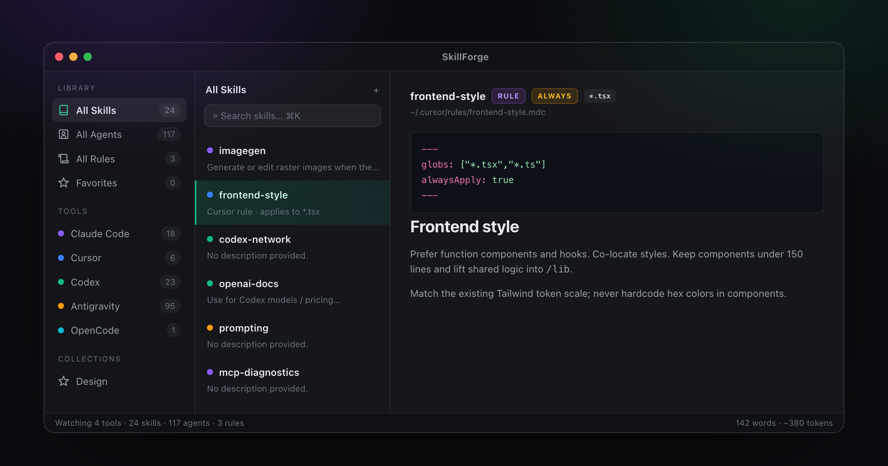

<p align="center">
  
</p>

<h1 align="center">SkillForge</h1>

<p align="center">
  <b>Your AI agent skills, finally organized.</b><br>
  A cross-platform Electron desktop app to browse, edit, and manage the skills,
  agents, and rules across Claude Code, Cursor, Codex, Windsurf, Amp, Antigravity,
  OpenCode, and more — on macOS, Windows, and Linux.
</p>

<p align="center">
  
</p>

---

## Features

- **Auto-discovery** — crawls your home directory for every supported tool (no setup on macOS).
- **Live file watching** — external edits show up instantly.
- **Skills, Agents & Rules** — rules are first-class; Cursor `.mdc` `globs` / `alwaysApply` shown as badges.
- **Editor + live preview** — CodeMirror markdown editor with a rendered preview a keystroke away.
- **Full-text search** — across names, descriptions, and content (`⌘K`).
- **Collections** — group skills into named, icon-tagged collections (stored in-app, never touching your files).
- **Favorites** — star skills for quick access.
- **Copy across tools** — share one skill into another tool's directory in a click.
- **Keyboard-first** — see the shortcuts below.
- **Dark / Light / System** themes.
- **Token & word count** — live in the status bar, for prompt-budget awareness.

## Supported tools

Claude Code · Cursor · Codex · Windsurf · Amp · Antigravity · OpenCode · Claude Desktop · Global Agents

## Keyboard shortcuts

| Action | Shortcut |
|---|---|
| Search | `⌘K` / `Ctrl+K` |
| Edit mode | `⌘E` |
| Preview mode | `⌘P` |
| Save | `⌘S` |
| Open Settings | `⌘,` |
| Delete (confirms) | `⌘⌫` |
| Close Settings | `Esc` |

---

## Prerequisites

- **Node.js ≥ 22.12** (Electron 43 requires it) and npm
- Git
- Platform toolchains are only needed to **package** installers:
  - **macOS** builds → run on macOS
  - **Windows** builds → run on Windows (or CI). Cross-building from macOS/Linux needs Wine.
  - **Linux** builds → run on Linux, or produce an AppImage from macOS

Check your Node version:

```bash
node -v   # should print v22.12.0 or newer
```

## Getting started

```bash
git clone https://github.com/thirukguru/skillforge.git
cd skillforge
npm install
```

### Run in development

Vite dev server + Electron with hot reload:

```bash
npm run dev:electron
```

Or run just the web UI in a browser (no Electron / no file access):

```bash
npm run dev          # http://localhost:5173
```

## Compiling / building

The build has two stages: the **renderer** (Vite → `dist/`) and the **Electron
main process** (TypeScript → `dist-electron/`). The `build:*` scripts run both,
then package installers with electron-builder into `release/`.

```bash
# Type-check + build renderer only
npm run build

# Compile the Electron main process (dist-electron/)
npm run compile:electron

# Package installers (renderer + main + electron-builder)
npm run build:mac      # → release/*.dmg, *.zip   (Apple Silicon)
npm run build:win      # → release/*.exe          (run on Windows)
npm run build:linux    # → release/*.AppImage
npm run build:all      # all three (needs each platform's toolchain)
```

### All scripts

| Script | What it does |
|---|---|
| `npm run dev` | Vite dev server (renderer only) |
| `npm run dev:electron` | Compile main, then Vite + Electron with hot reload |
| `npm run build` | `tsc -b` + `vite build` (renderer → `dist/`) |
| `npm run compile:electron` | `tsc -p tsconfig.electron.json` → `dist-electron/` |
| `npm run build:mac` / `:win` / `:linux` / `:all` | Full build + electron-builder packaging |
| `npm run lint` | oxlint |
| `npm run preview` | Preview the built renderer |

### Build outputs

| Folder | Contents | Tracked? |
|---|---|---|
| `dist/` | Bundled renderer (HTML/JS/CSS) | gitignored |
| `dist-electron/` | Compiled main + preload | gitignored |
| `release/` | Packaged installers (dmg/exe/AppImage) | gitignored |

## Project structure

```
skillforge/
├── electron/                 # Electron main process
│   ├── main.ts               # BrowserWindow + IPC handlers
│   ├── preload.ts            # Context-bridge API
│   └── services/             # fileScanner, fileWatcher, fileSystem, settingsStore
├── src/                      # React renderer
│   ├── components/           # layout, editor, skills, collections, settings, registry
│   ├── stores/               # Zustand stores (app / editor / settings)
│   ├── lib/                  # toolSources, skillActions, textStats, collectionIcons…
│   └── types/                # shared TypeScript types
├── resources/                # App icons (icon.icns / .ico / .png)
├── scripts/                  # build helpers (writes dist-electron/package.json)
└── package.json              # scripts + electron-builder config
```

## Tech stack

Electron 43 · React 19 · Vite · Tailwind CSS v4 · Zustand · CodeMirror · react-markdown · chokidar · electron-store · electron-builder

## Code signing

Builds are **not yet signed or notarized** (that needs a paid Apple Developer ID
/ Windows certificate). Running in development or a locally-built app opens
normally; a packaged app you distribute will show a first-launch Gatekeeper
(macOS) or SmartScreen (Windows) prompt. Signing & notarization are on the
roadmap.

## License

MIT
